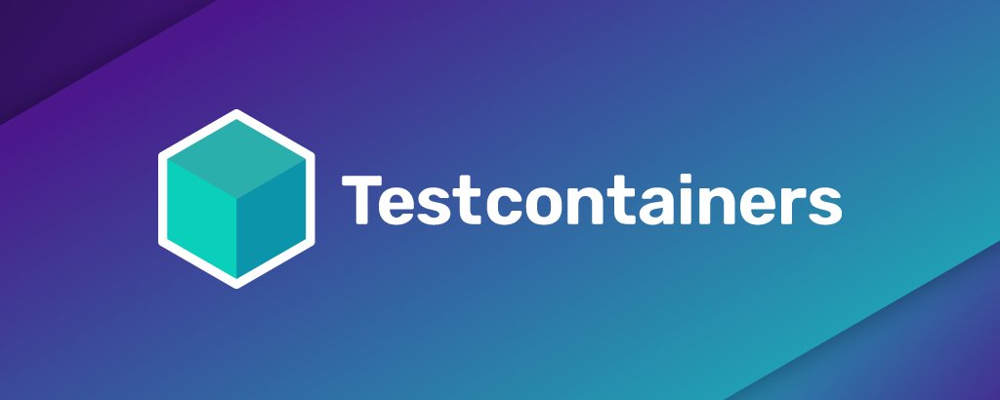

# Testcontainers

## About

Testcontainers for .NET is a library to support tests with throwaway instances of Docker containers for all compatible .NET Standard versions. The library is built on top of the .NET Docker remote API and provides a lightweight implementation to support your test environment in all circumstances.

Choose from existing pre-configured modules and start containers within a second, to support and run your tests. Or create your own container images with Dockerfiles and run your containers and tests immediately afterward.

## Supported operating systems

Testcontainers supports Windows, Linux, and macOS as host systems. Linux Docker containers are supported on all three operating systems. Native Windows Docker containers are only supported on Windows. Windows requires the host operating system version to match the container operating system version. You will find further information about Windows container version compatibility [here][windows-container-version-compatibility].

With Docker Desktop you can switch the engine either with the tray icon context menu or: `$env:ProgramFiles\Docker\Docker\DockerCli.exe -SwitchDaemon` or `-SwitchLinuxEngine`, `-SwitchWindowsEngine`.

## System requirements

Testcontainers requires a Docker-API compatible container runtime. During development, Testcontainers is actively tested against recent versions of Docker on Linux, as well as against Docker Desktop on Mac and Windows. These Docker environments are automatically detected and used by Testcontainers without any additional configuration being necessary.

It is possible to configure Testcontainers to work for other Docker setups, such as a remote Docker host or Docker alternatives. However, these are not actively tested in the main development workflow, so not all Testcontainers features might be available and additional manual configuration might be necessary. If you have further questions about configuration details for your setup or whether it supports running Testcontainers-based tests, please contact the Testcontainers team and other users from the Testcontainers community on [Slack][slack-workspace].

## License

See [LICENSE](https://raw.githubusercontent.com/testcontainers/testcontainers-dotnet/master/LICENSE).

## Copyright

Copyright (c) 2019 - 2022 Andre Hofmeister and other authors.

See [contributors][testcontainers-dotnet-contributors] for all contributors.

----

Join our [Slack workspace][slack-workspace] | [Testcontainers OSS][testcontainers-oss] | [Testcontainers Cloud][testcontainers-cloud]

[windows-container-version-compatibility]: https://docs.microsoft.com/en-us/virtualization/windowscontainers/deploy-containers/version-compatibility
[testcontainers-dotnet-contributors]: https://github.com/testcontainers/testcontainers-dotnet/graphs/contributors/
[slack-workspace]: https://slack.testcontainers.org/
[testcontainers-oss]: https://www.testcontainers.org/
[testcontainers-cloud]: https://www.testcontainers.cloud/
